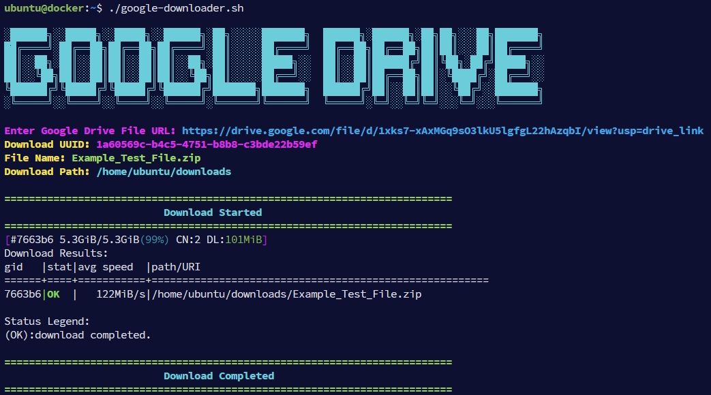

# Google Drive File Downloader



## Overview
This script allows you to download files from Google Drive using their public file URLs. It extracts the Google Drive file ID, fetches necessary metadata, and downloads the file using `aria2c`.

## Prerequisites
Ensure you have the following dependencies installed on your system:
- `aria2c` (for downloading files)
- `curl` (for fetching metadata from Google Drive)

To install `aria2c`, run:
```bash
sudo apt update && sudo apt install aria2 -y
```

## Usage
1. Clone the repository:
   ```bash
   git clone https://github.com/av1-is-better/Google-Drive-Aria2c-Downloader-Bash-Script.git
   cd Google-Drive-Aria2c-Downloader-Bash-Script

2. Change DOWNLOAD_DIR value within bash script
   ```bash
   vi google-downloader.sh
   ```

3. Make the script executable:
   ```bash
   chmod +x google-downloader.sh
   ```
4. Run the script:
   ```bash
   ./google-downloader.sh
   ```
5. Enter the Google Drive file URL when prompted.

6. Enjoy :)

## Features
- Automatically extracts Google Drive file ID from various URL formats.
- Fetches filename and UUID before initiating the download.
- Uses `aria2c` for fast and efficient downloading with multiple connections.
- Supports resuming interrupted downloads.

## Troubleshooting
- If the script fails with `Error: aria2c not found`, install `aria2c` using the command above.
- If the script fails to extract the file ID, verify the URL format.
- Ensure the file is publicly accessible or shared with "Anyone with the link".

## Notes
- The default download directory is set to `/home/ubuntu/downloads`. Modify `DOWNLOAD_DIR` in the script to change it.
- This script does not bypass Google Drive file access restrictions.

## License
This script is released under the MIT License.